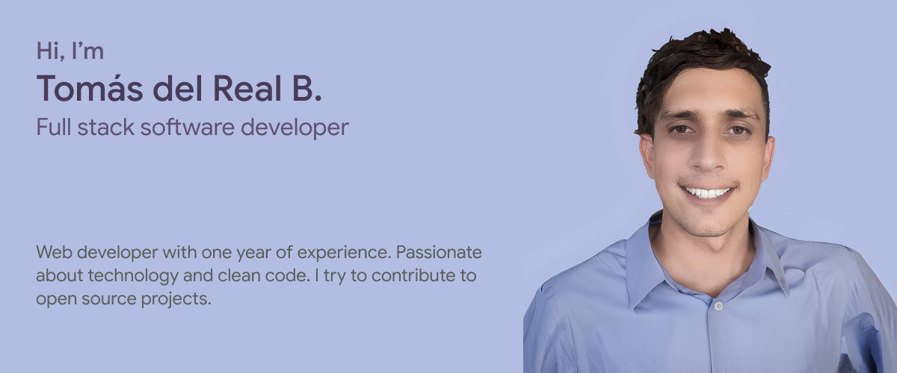

<h1 align='left'>Hi there, Tomás here👋</h1>

<p> 

</p>

```js
const tdelrealb = {
  pronouns: "he" | "him",
  languages: [Javascript, Typescript, Python, HTML, CSS],
  frontend: [React, Svelte, Tailwind],
  backend: [Node, Express],
  database: [MongoDB, MySQL, PostgreSQL, CouchDB],
  tools: [AWS, Docker, Google Cloud, Budibase (No Code)]
};
```

<br>

<p align='left'>👨‍💻 Web developer with one year of experience in Santiago, Chile. Specialized in front-end and back-end development, with a focus on technologies such as JavaScript, HTML, CSS, and frameworks like React and Node.js. Passionate about creating fluid and functional web experiences.

<br>
🧠 Constantly looking to learn and improve my technical skills, as well as keeping up to date with the latest trends and best practices in web development. I strongly believe in the power of clean and well-structured code for easy maintenance and scalability of projects.

<br>
🚀 Always open to new opportunities for collaboration and professional growth - let's connect and do amazing things together!</p>

<h3 align='left'>Experience</h3>
<p align='left'> Software Developer on SocialWeb (2024).</p>

<h3 align='left'>Education</h3>

<p align='left'>Coding Dojo | MERN Stack (2023).</p>
<p align='left'>Universidad del Desarrollo | Film Degree (2017 - 2022).</p>

<br>

<div align='center'>


<br>

[](https://github.com/tdelrealb/Lifesphere-YourLifeOrganizer)[](https://github.com/tdelrealb/Budibase-CustomComponents)

</div>

<br>

<p align='center'>Connect with me</p>
<p align='center'>
<a href='https://linkedin.com/in/tdelrealb' target='blank'>

</a>
<a href="https://instagram.com/delrealtomas.dev" target="blank"></a>
<a href="https://discord.gg/tdelrealb" target="blank"></a>
</p>
